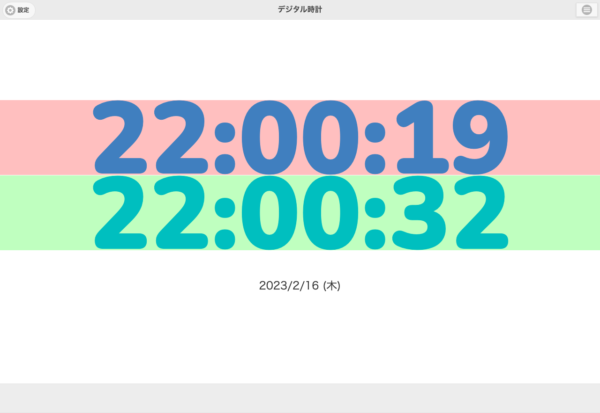

# スクリーンショット比較ツール

## このツールで出来ること

- URLリストを読み込み、そのURLのページスクリーンショットを取得
- 取得したスクリーンショット同士を比較

## 使い方

### スクリーンショットを取る
```zsh
$ pagediff  screenshot --urllist==[URLリストのCSV] --browser[Chromium or Firefox or Webkit]
```
./screenshots/yyyyMMdd_hhmmssに格納されます

###スクリーンショットを比較する
```zsh
$ pagediff diff --from=[比較元のディレクトリ(yyyyMMdd_hhmmss)] --to=[比較先のディレクトリ(yyyyMMdd_hhmmss)]
```
指定したディレクトリの同名ファイルを比較します。
./screenshots/[比較元のディレクトリ]-[比較先のディレクトリ]/diff-[スクリーンショットファイル名]で保存されます。

### サンプル

